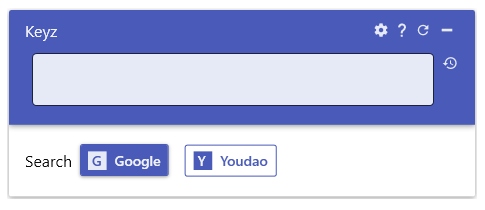
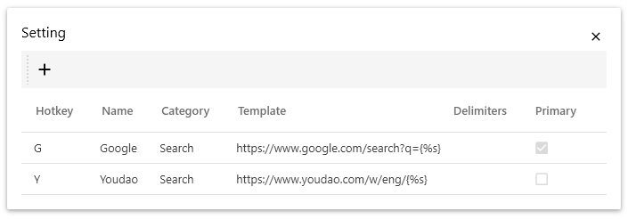

# Keyz

Keyz is an application for quickly search keywords in various websites.

## How to use

1. Start Keyz
2. Highlight a piece of text
3. Press Alt+G
4. Press The button you want to go to.

## Customization

You can easy customize and define you own hotkey in setting.

You can add or delete buttons, editting is not supported yet.

## Mentions

* 
Icons made by <a href="https://www.flaticon.com/authors/dinosoftlabs" title="DinosoftLabs">DinosoftLabs</a> from <a href="https://www.flaticon.com/" title="Flaticon">www.flaticon.com</a>

* UI Library: [MaterialDesignInXamlToolkit](https://github.com/MaterialDesignInXAML/MaterialDesignInXamlToolkit)
* Copy to software feature depends on [AutoHotkey.Interop](https://github.com/amazing-andrew/AutoHotkey.Interop). This software is built on .NET Core, so I repack this project under .NET Core. See [this repository](https://github.com/rabbitism/AutoHotkey.Interop).
* Special thanks to Schlumberger, who inspired this design.